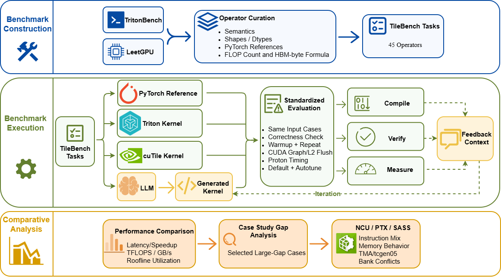
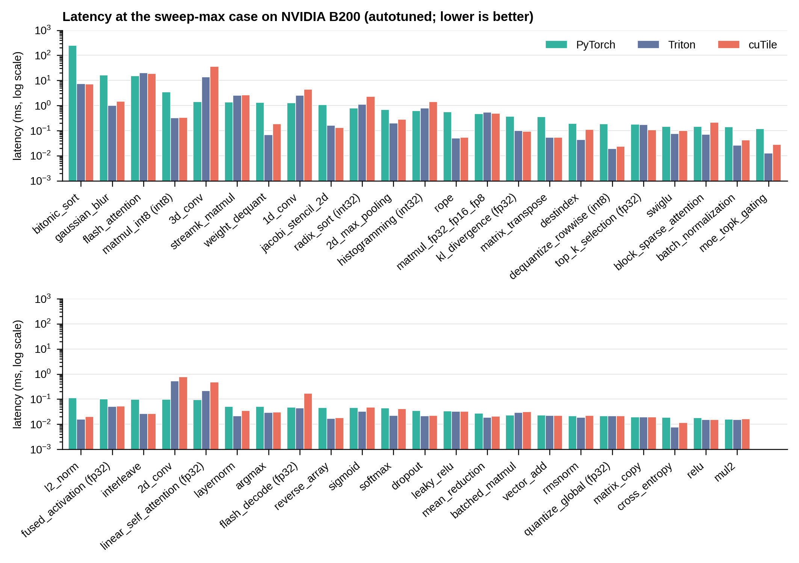

<h1 align="center">
  <picture>
    <source media="(prefers-color-scheme: dark)" srcset="assets/tilebench_icon_dark.png">
    
  </picture>
</h1>

## 👋 Overview

TileBench is a modular accelerator benchmarking framework for comparing kernel implementations under standardized operator semantics, correctness checks, timing protocols, autotuning, and hardware-aware performance metrics.
It currently supports **PyTorch**, **Triton**, **NVIDIA cuTile**, **TileLang**, and **AWS Neuron NKI** backends.

[ NCU Reports](https://huggingface.co/datasets/bcui2/NCU_report) | [ LLM Artifacts](https://drive.google.com/file/d/1yBPmzuHMnKeblaK4jd3BPmkxLg9o-Z8v/view?usp=sharing) | [ Raw Logs](https://github.com/Deep-Learning-Profiling-Tools/Tilebench/tree/archive/raw-logs-2026-09-18) | [ Developer Guide](docs/developer_guide.md)



## 📑 Contents

- [Features](#-features)
- [Results](#-results)
- [Benchmark Suite](#-benchmark-suite)
- [Backend Support](#-backend-support)
- [Installation](#-installation)
- [Quick Start](#-quick-start)
- [Evaluation Methodology](#-evaluation-methodology)
- [LLM Kernel Generation](#-llm-kernel-generation)
- [Project Structure](#-project-structure)
- [Recorded Results](#-recorded-results)
- [Developer Guide](#-developer-guide)
- [Attribution](#-attribution)

## ✨ Features

- **45 operator tasks** covering point-wise, reduction/normalization, matrix multiplication/attention, stencil/convolution, and data-layout workloads.
- **Shared correctness harness** using PyTorch references and dtype-aware verification.
- **Multiple backends**: PyTorch, Triton, cuTile, TileLang, and NKI.
- **Default and autotuned execution paths** for controlled configuration studies.
- **Proton-based timing** with warmup, CUDA graph replay, and optional L2 flushing.
- **Hardware-aware metrics** including latency, speedup, effective bandwidth, TFLOPS, arithmetic intensity, percentage of peak, and roofline utilization.
- **Profiling support** with Nsight Compute metadata and kernel-count validation.
- **Iterative LLM kernel generation** with correctness and performance feedback.

## 📊 Results

### Pairwise wins and losses

**45 operators · NVIDIA B200 · autotuned Triton and cuTile · complete valid dtype and input-size sweeps**

Each cell reports **wins / losses for the row backend against the column backend**. Each operator contributes one comparison based on the geometric mean of its valid per-case latency ratios.

| Row vs. column | Triton | cuTile | PyTorch |
|:---|:---:|:---:|:---:|
| **Triton** | N/A | **37 / 8** | **36 / 9** |
| **cuTile** | 8 / 37 | N/A | **33 / 12** |
| **PyTorch** | 9 / 36 | 12 / 33 | N/A |

Across the suite, Triton reaches a **2.02×** geometric-mean speedup over PyTorch, while cuTile reaches **1.58×**.

Triton and cuTile remain workload-dependent rather than uniformly ordered. Triton is stronger across many irregular, streaming, and bandwidth-bound operators, while cuTile is competitive on regular tiled workloads with strong reuse, including selected GEMM, attention, and stencil cases.

Autotuning improves both backends relative to their manually selected defaults, with geometric-mean gains of **1.18× for Triton** and **1.22× for cuTile** within the declared search spaces.

### Representative large-input latency



The figure shows one sweep-max case per operator. FP16 is used when available; otherwise the first configured dtype is shown in the label. Triton and cuTile use their autotuned configurations.

The figure and the pairwise matrix summarize different case sets: the figure shows one representative large case per operator, while the matrix uses the complete valid dtype and input-size sweep.

Regenerate the figure with:

```bash
python scripts/plot_sweep_max.py --gpu B200 --output assets/sweep_max_latency.png
```

Without `--output` the figure goes to `results/<gpu>/figures/`, so plotting another GPU never overwrites this one.

## 🧩 Benchmark Suite

TileBench contains **45 operators**, with 26 task definitions derived from TritonBench and 19 from LeetGPU. Each operator provides a PyTorch reference, backend implementations, a case grid, benchmark controls, and metric formulas.

| Category | # Operators | Representative tasks |
|:---|---:|:---|
| Point-wise | 12 | vector addition, activations, weight dequantization |
| Reduction / Normalization | 11 | softmax, layer normalization, argmax, MoE gating |
| Matrix Multiplication / Attention | 8 | GEMM variants, dense attention, sparse attention |
| Stencil / Convolution | 6 | 1D/2D/3D convolution, pooling, Jacobi stencil |
| Data Layout | 8 | copy, transpose, indexing, sorting |
| **Total** | **45** | |

Operator definitions live under:

```text
tilebench/benchmarks/operators/
```

Each configured dtype is evaluated over the operator's declared input-size sweep.

## 🔌 Backend Support

| Backend | Accelerator | Role | Results |
|:---|:---|:---|:---:|
| **PyTorch** | NVIDIA GPU / device-local baseline | Semantic reference and correctness baseline | Baseline |
| **Triton** | NVIDIA GPU | Tile-based kernel backend | Available |
| **NVIDIA cuTile** | NVIDIA GPU | Tile-based kernel backend | Available |
| **TileLang** | NVIDIA GPU | Optional tile-language backend | N/A |
| **AWS Neuron NKI** | AWS Trainium | Optional accelerator backend | N/A |

Backend coverage is operator-specific. Unsupported dtype/backend combinations are reported rather than silently treated as successful cases.

NKI runs on Trainium and is compared against a device-local PyTorch reference on the same platform.

## 📦 Installation

TileBench requires **Python 3.10+**.

Clone the repository and install it in editable mode:

```bash
git clone https://github.com/Deep-Learning-Profiling-Tools/Tilebench.git
cd Tilebench

python -m pip install -e .
```

The Python dependencies are declared in `requirements.txt`. NVIDIA CUDA and AWS Neuron runtime/toolchain setup remain platform-specific and must be installed for the backend being used.

The NKI backend requires a configured AWS Trainium/Neuron environment.

## 🚀 Quick Start

### Run one operator

Run the fixed default configuration for Triton and cuTile:

```bash
python scripts/run_bench.py \
  --gpu B200 \
  --operator mul2 \
  --tile-language triton,cutile
```

Run the autotuned configuration:

```bash
python scripts/run_bench.py \
  --gpu B200 \
  --operator mul2 \
  --tile-language triton,cutile \
  --autotune
```

PyTorch runs automatically as the reference baseline.

`--gpu` is the hardware label of the machine being measured. It is required and has no default: every result is written under `results/<gpu>/`, so runs on different GPUs never overwrite each other. On another machine, change the label (for example `--gpu GH200`).

Tracked summary CSVs are written to:

```text
results/B200/csv/mul2_default.csv
results/B200/csv/mul2_autotune.csv
```

Local timing logs, profiling outputs, figures, and other generated artifacts are ignored by Git. Each run keeps its own raw JSON, named after the mode and the backend selection, so runs of one operator never overwrite each other:

```text
results/B200/logs/time_measurement_logs/mul2_default_triton-cutile.json
results/B200/logs/time_measurement_logs/mul2_autotune_triton-cutile.json
```

### Run selected cases

```bash
python scripts/run_bench.py \
  --gpu B200 \
  --operator mul2 \
  --tile-language triton,cutile \
  --case-indices 0,1,2
```

### Visualize results

```bash
python scripts/visualize.py \
  --gpu B200 \
  --operator mul2 \
  --tile-language triton,cutile \
  --metrics latency_ms bandwidth_GBs speedup pct_peak_bw roofline
```

`--gpu` selects both the result namespace (`results/B200/logs/` in, `results/B200/figures/` out) and the peak-performance metadata used by the roofline metrics. `--tile-language` names the run to read, as it was passed to `run_bench.py`; add `--mode autotune` for an autotuned run. Generated figures are local outputs and are not tracked.

### Run the full suite

```bash
python scripts/run_bench_all.py --gpu B200
```

Each run is stored under `results/<gpu>/runs/`, with the GPU label recorded in its manifest. See `--help` for the remaining options.

## 🔬 Evaluation Methodology

### Correctness

PyTorch defines the reference output. Each backend is verified before timing using dtype-aware tolerances from `tilebench/core/verifier.py`, with operator-specific overrides where required by the numerical contract.

Integer outputs use exact comparison by default.

A backend that fails verification is excluded from timing for that case.

### Timing

The standard NVIDIA timing path uses:

- 20 warmup launches
- 100 timed launches
- Triton Proton
- CUDA graph replay
- optional L2 flushing outside the timed operator invocation

A multi-kernel implementation is timed as one complete operator `run()`, preserving intended producer-to-consumer reuse inside the operator boundary.

### Autotuning

The default path uses a fixed manually selected configuration.

The autotuned path searches a declared backend-specific configuration space and records the selected configuration. Triton and cuTile expose different tuning controls, so TileBench aligns search scope and granularity rather than forcing a one-to-one parameter mapping.

### Aggregation

For each valid case, TileBench computes latency ratios between implementations.

Operator-level values use the geometric mean over valid dtype and input-size cases. Suite-level speedups use the geometric mean over operator-level values, giving every operator equal weight.

### Hardware-aware metrics

Each operator declares analytical FLOP and byte formulas in `config.yaml`. These formulas are used consistently to derive:

- TFLOPS
- effective bandwidth
- arithmetic intensity
- percentage of peak
- roofline utilization

Canonical device metadata is stored under:

```text
tilebench/data/peak_performance/
```

Profiling metadata used by the NCU harness is generated per hardware, because autotune winners, kernel launch counts and kernel names are measured on one GPU:

```text
outputs/profiling/<hardware>/
├── ncu_catalogue.json
└── kernel_counts.json
```

Like the NCU reports, these files are generated data: they are written by `scripts/profiling/ncu_catalogue.py` and `scripts/profiling/probe_kernel_count.py`, ignored by Git, and not part of the installed package. Each GPU has its own directory, and the NCU tools take `--gpu` and refuse a GPU that has no metadata rather than borrowing another GPU's.

Generated NCU reports are local artifacts, written to `outputs/ncu/<hardware>/`, and are not tracked. The released artifact contains 220 raw Nsight Compute reports, the paper's B200 profiles. They cover 45 operators for Triton and cuTile across every profiled dtype (11.8 GB) and are hosted on [Hugging Face](https://huggingface.co/datasets/bcui2/NCU_report). Downloading them requires a free Hugging Face login.

## 🤖 LLM Kernel Generation

TileBench also includes an iterative LLM kernel-generation workflow under:

```text
tilebench/llm_codegen/
```

The workflow combines operator descriptions, backend API references, framework constraints, PyTorch references, correctness feedback, and performance feedback across refinement iterations.

The pipeline source above is version-controlled. What it generates is not: each run writes its prompts, responses, kernels, feedback and token usage to

```text
tilebench/benchmarks/llm_generated/<operator>/<model>/<effort>/
```

This is the runtime output path. It is Git-ignored and created on demand, so a fresh clone does not ship the 6140 files of the paper campaign.

The frozen trajectories behind the paper's LLM results (45 operators × 2 models, 732 iterations) are published as a separate artifact. One command downloads it, verifies its SHA256 and restores it automatically to `tilebench/benchmarks/llm_generated/`:

```bash
python scripts/fetch_artifacts.py --artifact llm-aacl2026
```

The archive (28 MB, 6140 files) is also available directly from [Google Drive](https://drive.google.com/file/d/1yBPmzuHMnKeblaK4jd3BPmkxLg9o-Z8v/view?usp=sharing); its URL and checksum are recorded in `artifacts/manifest.json`. An existing, non-empty directory is left alone unless `--force` is given.

The generation workflow is separate from the manually implemented benchmark path. Generated implementations are evaluated under their own protocol and do not modify the manually maintained kernels.

## 📁 Project Structure

```text
Tilebench/
├── tilebench/
│   ├── core/                    # Benchmark engine, timing, verification, metrics, autotuning
│   ├── data/                    # Input generators and canonical device metadata
│   ├── benchmarks/
│   │   ├── operators/           # 45 operator definitions and backend implementations
│   │   └── llm_generated/       # Local LLM-generated artifacts (Git-ignored)
│   ├── profiling/               # NCU library: kernel selection, capture validation, catalogue
│   ├── llm_codegen/             # Iterative LLM generation and evaluation pipeline
│   └── paths.py                 # Repository/package resource resolution
├── scripts/                     # Benchmark, visualization, peak-measurement, artifact entry points
│   └── profiling/               # NCU command-line tools and the harness NCU executes
├── artifacts/                   # Manifest of downloadable artifacts
├── skills/                      # Backend API/programming guides used by generation
├── tests/                       # Test suite
├── results/
│   └── <hardware>/              # One namespace per GPU; B200 is the one committed today
│       └── csv/                 # Tracked per-case benchmark summaries
├── assets/                      # README images and link icons
├── docs/                        # Extended documentation
├── pyproject.toml
├── requirements.txt
└── README.md
```

## 💾 Recorded Results

Results are scoped by hardware, and only the summary CSVs are version-controlled:

```text
results/<hardware>/csv/
├── <operator>_default.csv
└── <operator>_autotune.csv
```

The PyTorch, Triton, cuTile and TileLang columns under one `results/<hardware>/` namespace were measured on that hardware. The results committed today are the paper's B200 measurements, in `results/B200/csv/`: 45 operators, with one default-mode and one autotuned CSV per operator. Results for other hardware sit beside them, for example `results/GH200/csv/`, with no code change: the label passed to `--gpu` names the directory.

NKI measurements are stored alongside the B200 campaign results for a unified per-operator record, but they are cross-hardware measurements: NKI runs on AWS Trainium, not on B200. When present, they appear as three extra columns, `torch_nki_ms`, `nki_ms` and `speedup_nki`. `nki_ms` is compared against the device-local `torch_nki_ms` baseline, not against the B200 `torch_ms` value, so `speedup_nki = torch_nki_ms / nki_ms`. NKI logs and profiles are kept under `results/B200/logs/` in the same way.

Everything else is a generated artifact, ignored on `main`:

| Artifact | Local path | Where it is kept |
|:---|:---|:---|
| Raw timing and autotune logs | `results/<hardware>/logs/` | [ `archive/raw-logs-2026-09-18`](https://github.com/Deep-Learning-Profiling-Tools/Tilebench/tree/archive/raw-logs-2026-09-18) branch: the paper's frozen raw logs are preserved there, under `results/B200/logs/` |
| LLM-generated trajectories and kernels | `tilebench/benchmarks/llm_generated/` | The paper snapshot is published on [ Google Drive](https://drive.google.com/file/d/1yBPmzuHMnKeblaK4jd3BPmkxLg9o-Z8v/view?usp=sharing) and restored with `fetch_artifacts.py`; it is also preserved on the same archive branch |
| Nsight Compute reports | `outputs/ncu/<hardware>/` | [ Hugging Face dataset](https://huggingface.co/datasets/bcui2/NCU_report) |
| NCU profiling metadata (catalogue, kernel counts) | `outputs/profiling/<hardware>/` | Regenerated by the NCU tools; the paper's B200 files are preserved on the same archive branch |
| Figures, aggregates, run directories, peak sweeps | `results/<hardware>/figures/`, `aggregate/`, `runs/`, and `outputs/` | Local only; regenerated by the scripts |

Running a benchmark only writes these files; it performs no Git operation. Maintainers build a downloadable snapshot with `python scripts/package_artifacts.py --artifact <name>`.

## 📘 Developer Guide

Implementation details, CLI options, operator-authoring rules, tuning conventions, dtype handling, and profiling internals are documented separately:

**[TileBench Developer Guide](docs/developer_guide.md)**

## 🤝 Attribution

TileBench uses TritonBench and LeetGPU as sources of operator coverage and task semantics. TileBench implementations and configurations are maintained independently in this repository.

Third-party libraries, tools, and dependencies remain governed by their respective licenses and terms.
